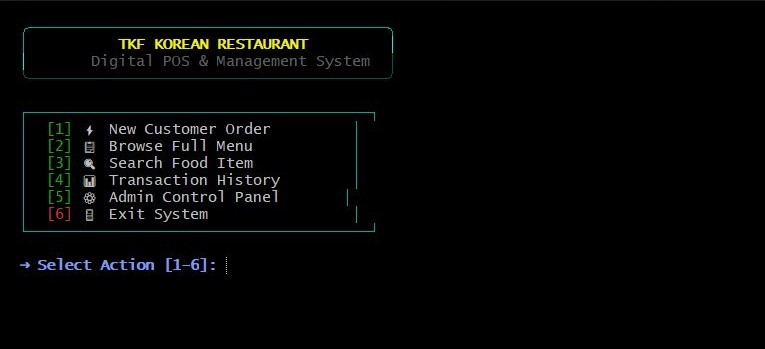

# TKF Restaurant Payment System

A console-based **restaurant ordering and payment system developed in C** to simulate the ordering and payment process of **The Korean Food (TKF) Restaurant**.

Originally developed as an academic project, this version represents a **personal enhancement and system improvement effort** by restructuring the source code, improving modularity, and introducing additional system functionalities.

---


---

## Application Preview

<div align="center">



*Modern interactive CLI dashboard with UTF-8 support and ANSI UI styling*

</div>

---

# Introduction

The **TKF Restaurant Payment System** is a console application designed to simulate a real-world restaurant Point-of-Sale (POS) system.

The system applies fundamental C programming concepts, including:

- Functions
- Arrays
- Structures (`struct`)
- File processing
- Modular programming

to develop a practical restaurant management solution.

This project demonstrates the application of **structured programming concepts in C** by solving a real-world problem through modular design, data management, and file-handling techniques.

---

# Objectives

- Simulate the ordering and payment process of a restaurant.
- Provide a user-friendly console-based ordering system.
- Apply fundamental C programming concepts in a practical application.
- Improve software design through modular programming.
- Develop problem-solving and software development skills.

---

# Programming Concepts Applied

## Functions

Functions are used to divide the system into smaller reusable components, improving:

- Code readability
- Maintainability
- Debugging efficiency

Examples:

- Menu management
- Order processing
- Payment calculation
- Receipt generation
- File handling

---

## Arrays

Arrays are used to store collections of related information, such as:

- Menu items
- Food prices
- Customer orders
- Transaction records

---

## Data Structures

The project utilizes structures (`struct`) to organize multiple data types into meaningful records.

Examples:

```c
struct Customer
{
    char name[50];
    char memberStatus[20];
    float totalBill;
};

struct Menu
{
    int id;
    char name[50];
    float regularPrice;
    float largePrice;
};

struct CartItem
{
    char foodName[50];
    char size[10];
    int quantity;
    float totalPrice;
};
```

Structures allow related information to be grouped together, making the system easier to organize and expand.

---

## File Processing

File handling is implemented to create, read, and store transaction records.

Transaction data is saved into:

```
TransactionRecord.txt
```

allowing transaction history to remain available after the program exits.

---

# Features

## Customer Features

- Display restaurant menu
- Place food orders
- Manage shopping cart
- Select food size
- Select quantity
- Apply member discounts
- Choose dine-in or takeaway options
- Calculate payment automatically
- Generate receipts
- Store transaction history

---

## Admin Features

- Add menu items
- Update menu prices
- Delete menu items
- View sales information
- Manage restaurant menu data

---

# Technologies Used

- C Programming Language
- GCC Compiler
- MSYS2 UCRT64 Environment
- Structured Programming
- File Processing
- Console Application

---

# Development Environment

This project is compiled and tested using **MSYS2 UCRT64**, a modern development environment that provides an updated GCC compiler toolchain for Windows.

MSYS2 UCRT64 provides:

- Latest GCC compiler support
- Modern C language compatibility
- Unix-like command-line environment
- Package management through `pacman`
- Improved compatibility compared to older MinGW distributions

## Compile

```bash
gcc main.c menu.c order.c payment.c receipt.c admin.c file.c utility.c -o TKF
```

## Run

```bash
./TKF.exe
```

---

# Development Enhancement

This version was independently developed to improve the original TKF Restaurant Payment System by introducing:

- Better source code organization
- Modular architecture
- Improved ordering workflow
- Shopping cart implementation
- Payment processing
- Administrative functions
- Persistent transaction records
- Improved maintainability

The enhancement focuses on transforming a basic console application into a more structured and scalable software system.

---

# Project Structure

```
TKF-Restaurant-Payment-System
│
├── main.c                  # Main program controller
├── tkf.h                   # Structures and function prototypes
│
├── menu.c                  # Menu management
├── order.c                 # Ordering and cart system
├── payment.c               # Payment calculation
├── receipt.c               # Receipt generation
├── admin.c                 # Admin management
├── file.c                  # Transaction file handling
├── utility.c               # Helper functions
│
├── TransactionRecord.txt  # Stored transaction history
│
└── README.md
```

---

# License

This project was developed for **educational and personal software development purposes**.

The original version was created as part of an academic project, while this enhanced version was independently improved to practice:

- Modular programming
- Software design principles
- System development using C
- File-based data management

---

